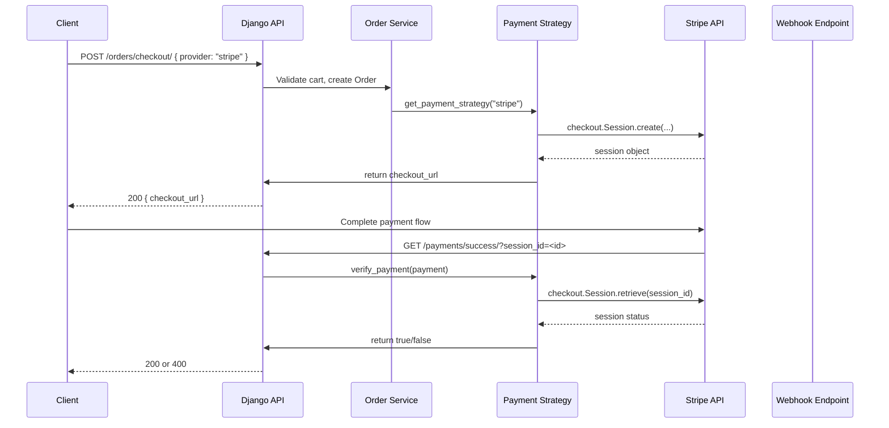

# Payment Flow

## Overview

Payment processing is handled by `paymentsApp` with a strategy pattern.
- Stripe is implemented.
- bKash exists as a placeholder with `NotImplementedError`.

## Stripe Payment Flow

### Data Stored
- `Payment.transaction_id` stores `session.id` from Stripe.
- `Payment.status` stores `pending`, `success`, or `failed`.
- `Order.status` is updated to `PAID` when verification succeeds.

## bKash Payment Flow

bKash is not implemented.
- `paymentsApp.services.bkash_payment.BkashPaymentStrategy.create_payment` raises `NotImplementedError`.
- `paymentsApp.services.bkash_payment.BkashPaymentStrategy.verify_payment` raises `NotImplementedError`.

## Notes
- Stripe flow depends on valid Stripe API keys in environment variables.
- `STRIPE_WEBHOOK_SECRET` is configured but webhook verification currently accepts raw payload when secret is absent.
